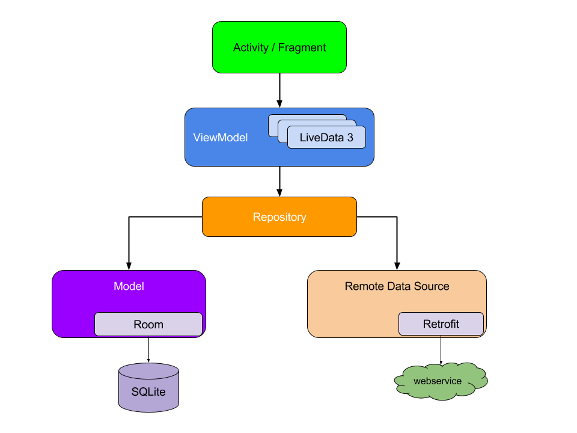
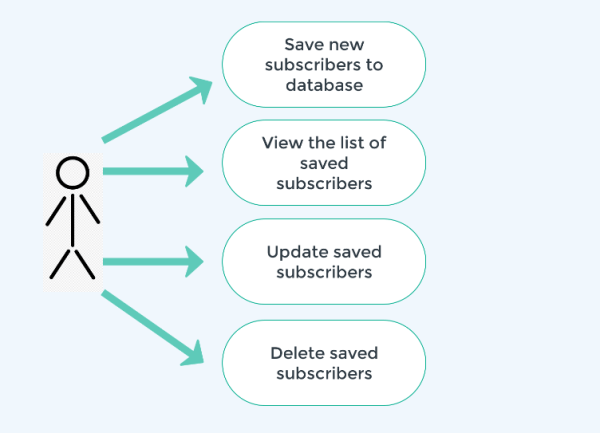

# Subs App

Você deve realizar a implementação de uma aplicação que mantenha persistência em banco de dados local ou em nuvem (especificar durante o envio), descrevendo o propósito da aplicação bem como o modelo de persistência, por exemplo (Alunos, Conta Bancária, Pessoas etc.). A aplicação deverá conter ao menos um método de persistência (inclusão). O arquivo deverá ser exportado em formato zip e anexado nesta tarefa. Em caso de dúvidas, pode perguntar no fórum de dúvidas.

## Arquitetura MVVM

## Usecase da aplicação

# Dados do Aluno

- Nome: Willian de Santana Angola
- Curso: Pós Graduação em Desenvolvimento Mobile
- Turma: Desenvolvimento Nativo para Android - 03/02/22 até 01/03/22
